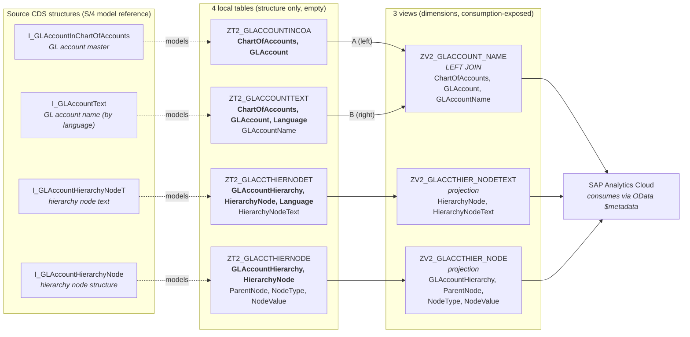
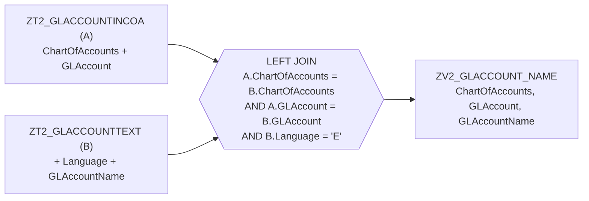
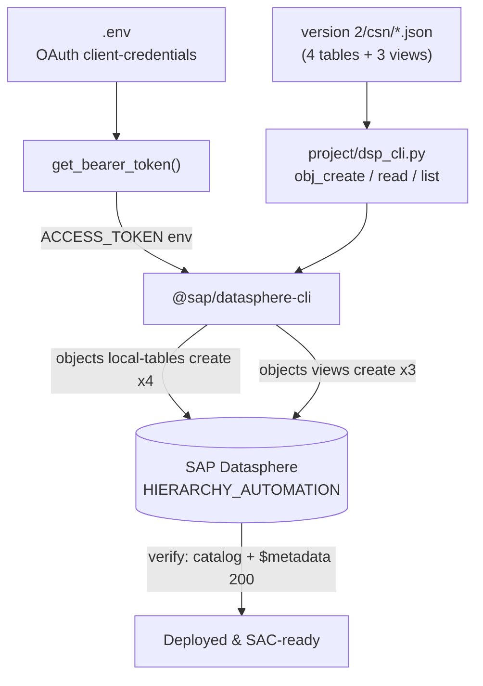

# Version 2 — How It Works (Diagrams)

Space: `HIERARCHY_AUTOMATION` · Tenant: `sdc-analytics-dwc.ap11.hcs.cloud.sap`
All objects built **headlessly by code** (no UI).

---

## 1. End-to-end data model (source → tables → views → SAC)

---

## 2. The join view (ZV2_GLACCOUNT_NAME)

Every GL account is kept even when no English text exists (left join); the `Language = 'E'`
predicate stops one-row-per-language multiplication.

---

## 3. How it is deployed (headless toolchain)

**Sequence:** author CSN → create 4 tables → create 3 views (join view after its 2 tables) →
verify deploy status + consumption exposure. Everything is reversible via `delete`.
